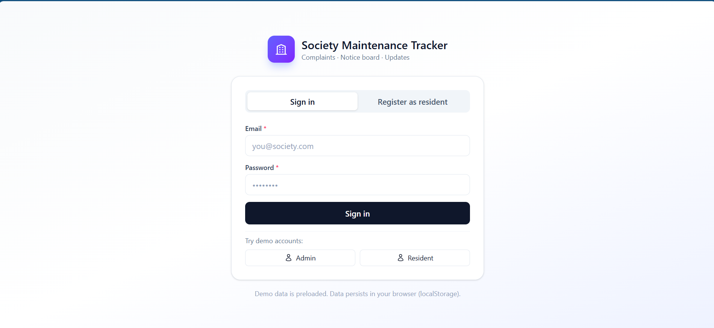
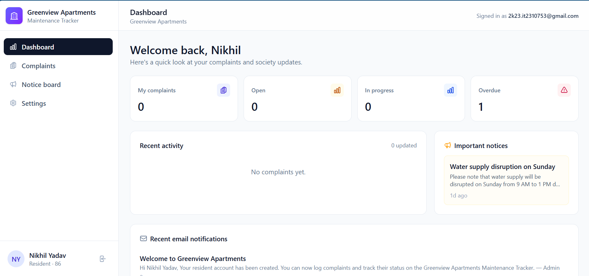
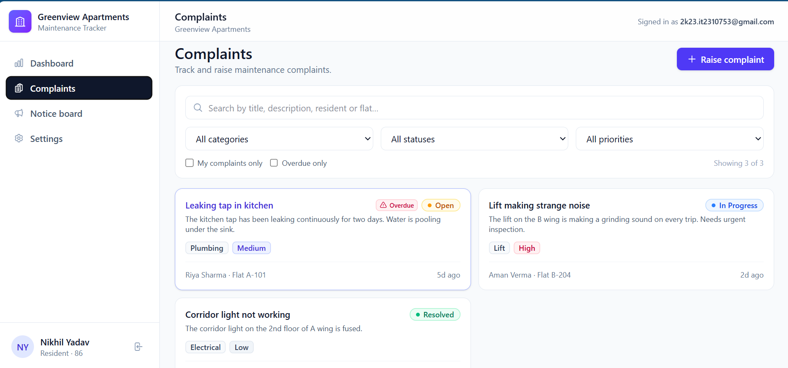
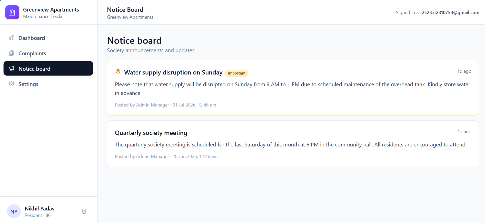
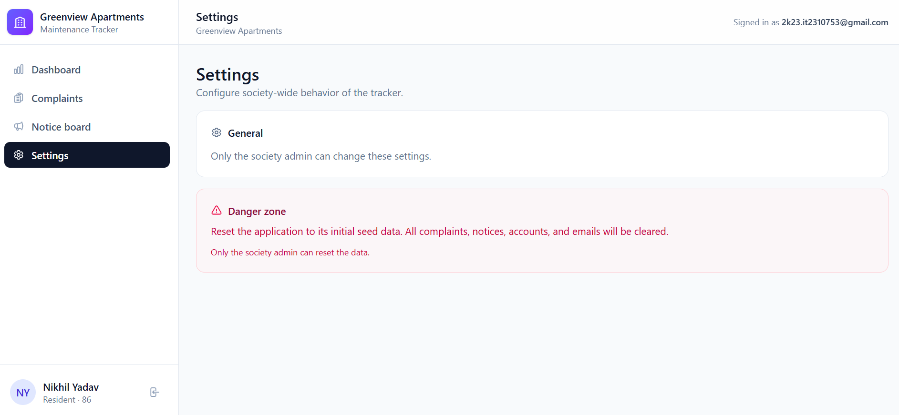
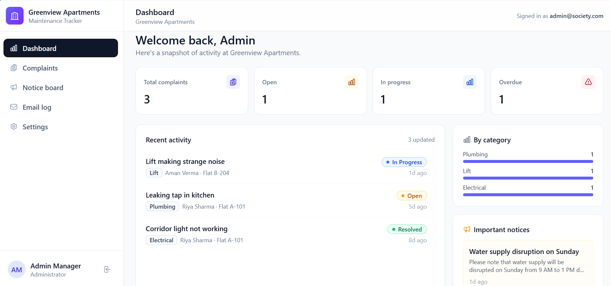
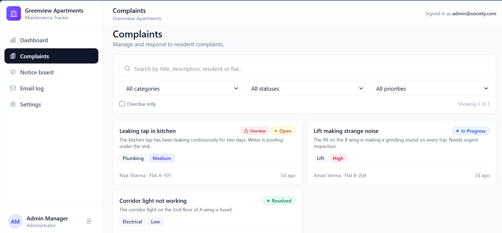
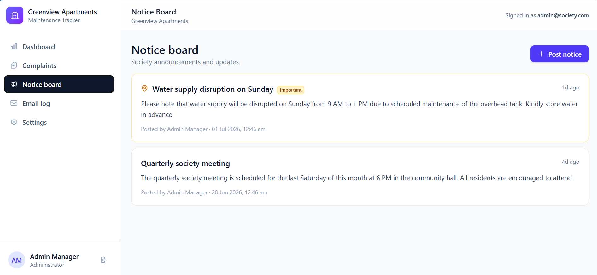
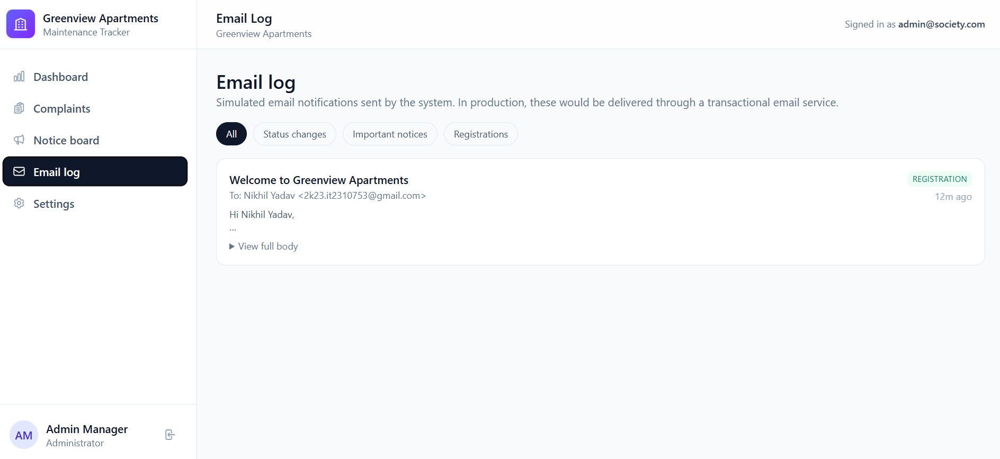
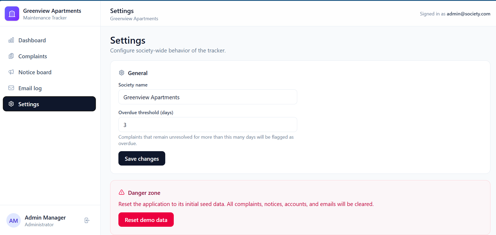

# Society Maintenance Tracker

A web platform where apartment residents raise maintenance complaints, track
their status through a clear workflow, and stay informed through a society
notice board — and the society admin manages everything from a single inbox.

> **Live demo accounts** (seeded automatically on first load):
> - **Admin:** `admin@society.com` / `admin123`
> - **Resident:** `riya@society.com` / `riya123`
> - **Resident:** `aman@society.com` / `aman123`

---

## ✨ Features

### For residents
- Register an account and log in
- Raise a complaint with title, description, category, priority, and **optional photo upload**
- View all of their complaints with full **status history**
- Filter complaints by category, status, and priority
- Receive simulated **email notifications** when their complaint status changes
- Receive email notifications when the admin posts an **important notice**

### For the society admin
- See all complaints across the society in a single inbox
- Filter by category, status, priority, and overdue
- **Update status** (`Open` → `In Progress` → `Resolved`) with an optional note
- Every change is recorded as a **history event** (`timestamp`, `actor`, `from`, `to`, `note`)
- **Overdue detection**: complaints still open beyond a configurable threshold are flagged automatically
- Post notices to the **notice board**, optionally marking one as **important** to pin it to the top and email all residents
- **Dashboard** with: total complaints, status breakdown, category breakdown, and overdue count
- Configure the **overdue threshold** and society name from **Settings**

### Cross-cutting
- **Role-based auth** (resident vs. admin)
- **Persistent storage** in the browser via `localStorage` (no backend needed for the demo)
- **Mobile-friendly** responsive layout
- Pre-seeded demo data so the app is interactive immediately

---

# 📸 Screenshots

## Login Page



---

## Resident Dashboard



---

## Complaints



---

## Notice Board



---

## Resident Settings



---

## Admin Dashboard



---

## Admin Complaint Management



---

## Admin Notice Management



---

## Email Log



---

## Admin Settings




## 🧱 Tech stack

| Layer        | Choice                                                  |
| ------------ | ------------------------------------------------------- |
| Frontend     | **React 19** + **TypeScript**                           |
| Bundler      | **Vite 7**                                              |
| Styling      | **Tailwind CSS 4**                                      |
| State        | React Context + `useReducer`-style pure updates         |
| Persistence  | `localStorage` (single-file inlined build via `vite-plugin-singlefile`) |

No backend is required to run the demo — the entire app is a single static
`dist/index.html` file produced by the build, which makes deployment to
GitHub Pages, Netlify, Vercel, Render, Railway, etc. trivial.

---

## 🚀 Getting started

### Prerequisites
- Node.js **18+** (Node 20 recommended)
- npm 9+ (bundled with Node)

### Install
```bash
npm install
```

### Run dev server
```bash
npm run dev
```
Then open the printed URL (usually `http://localhost:5173`).

### Production build
```bash
npm run build
```
Outputs a single self-contained `dist/index.html` (all JS + CSS inlined) that
you can serve from any static host.

### Preview the production build locally
```bash
npm run preview
```

---

## 📁 Project structure

```
.
├── index.html                  # Vite entry, sets page title
├── package.json                # Scripts and dependencies
├── tsconfig.json               # TypeScript config
├── vite.config.ts              # Vite + singlefile plugin
└── src
    ├── App.tsx                 # Top-level shell, routing, layout
    ├── main.tsx                # React root
    ├── index.css               # Tailwind entry + small global styles
    ├── types.ts                # Shared TS types
    ├── lib
    │   ├── store.ts            # Domain model, persistence, business logic
    │   ├── utils.ts            # Tiny className/date helpers
    │   └── AuthContext.tsx     # Auth provider + hooks
    └── components
        ├── AuthScreen.tsx           # Login & register UI
        ├── Dashboard.tsx            # Stats + recent activity
        ├── ComplaintsView.tsx       # List, filter, raise complaint
        ├── NewComplaintModal.tsx    # Form with photo upload
        ├── ComplaintDetailModal.tsx # Detail view + admin status updates
        ├── NoticeBoard.tsx          # Notice list + post-notice form
        ├── EmailLog.tsx             # Simulated email log
        ├── SettingsView.tsx         # Overdue threshold, society name, reset
        ├── Modal.tsx                # Reusable modal
        ├── EmptyState.tsx           # Empty-state placeholder
        ├── Badge.tsx                # Status/Priority/Category badges
        └── Icons.tsx                # Inline SVG icon set
```

---

## 🧠 System design (800-word write-up)

### 1. Complaint lifecycle and status history

A `Complaint` always carries a full **status history** rather than just a
current status field. The history is an append-only list of `StatusEvent`
records with this shape:

```ts
interface StatusEvent {
  id: string;
  timestamp: string;       // ISO 8601
  actorId: string;         // who made the change
  actorName: string;
  from: ComplaintStatus | "Created";
  to: ComplaintStatus;
  note?: string;           // free-form admin note
}
```

The lifecycle is:

1. `Created → Open` (when a resident submits the form)
2. `Open → In Progress` (admin starts work, can attach a note)
3. `In Progress → Resolved` (admin marks done, system stamps `resolvedAt`)
4. (Optional) `Resolved → …` is disallowed by the UI; complaints are closed.

Every transition is **immutable** — we never edit past events, we only append.
This gives an audit trail, makes the data safe to render in any order
(chronological vs. reverse-chronological), and lets future features like
"average resolution time" or "reopen" be added without schema changes.

Status history is rendered in `ComplaintDetailModal.tsx` with a timeline UI,
showing actor, the from→to change, optional italicized note, and exact
timestamp. The change buttons (admin only) are intentionally **stuck to the
current state** — you only see transitions that are valid from the current
status — which keeps the workflow safe.

### 2. Overdue detection

Overdue is **derived**, not stored as a manual flag. A helper
`isOverdue(createdAt, status, thresholdDays)` returns `true` when the
complaint's age exceeds the configured threshold and the status is not
`Resolved`. We expose a `recomputeOverdue` helper that re-runs this for every
complaint and is invoked whenever the state changes. We also re-run it
every minute via a `setInterval` inside `AuthProvider` so that simply leaving
the tab open eventually causes complaints to become overdue without a refresh.

The threshold itself is configurable from `Settings`, so an admin can change
"3 days" to "1 day" for high-priority societies without code changes. Because
overdue is derived, the flag can never get out of sync with reality.

### 3. Photo handling

Photos are attached during complaint submission. The user picks files via a
standard `<input type="file" accept="image/*" multiple>`. Each file is read
with `FileReader.readAsDataURL` to produce a base64 data URL, which is stored
inline on the `Complaint` record. This keeps the demo backend-free — the
trade-off is storage size, which is bounded by the user's localStorage quota
(typically 5–10 MB) and the maximum photo size we accept at the input level.

In a real deployment we'd swap this for a presigned-URL flow: the client
requests an upload URL from `/api/uploads`, `PUT`s the file to object storage
(S3 / R2), and stores only the resulting key on the complaint.

### 4. Notice board design

Notices are simple `{ id, title, body, important, pinned, createdAt }` records.
Sorting is computed at render time:

- **Pinned** notices (which are auto-pinned when `important` is true) bubble to
  the top.
- Within "pinned", newer first.
- Within "non-pinned", newer first.

Important notices also trigger an **email to every resident** through the
centralized `sendEmail` helper, which appends to an `EmailLog`. This makes
the system observable: the admin can audit who was told what and when.

### 5. Notification flow

We use a "tier of services" friendly design: the **email log** is the single
side-effect target. Every status change and every important notice flows
through one function:

```
domain mutation → sendEmail(to, subject, body, category) → state.emails
```

In production we'd wire this same call to a transactional email provider
(Resend, Postmark, SES) using a thin adapter — the rest of the app stays
unchanged. Residents see their own log on the Dashboard, and the admin can
inspect the entire log under the **Email log** view (admin-only).

### 6. Authentication and roles

`User.role` is `"resident" | "admin"`. The auth flow is intentionally simple
(demo) — credentials are matched against a `users` array, and the current
user id is stored on the app state. The provider exposes
`currentUser`, `login`, `logout`, and `register`. Resident self-registration
is allowed; admin accounts are seeded.

Authorization is enforced **at the UI level** in this demo (e.g. only the admin
sees the status-change buttons in `ComplaintDetailModal`). For a real
deployment, all write operations would be re-checked server-side against the
session's role — UI gating is necessary but never sufficient.

### 7. Why a single-file build?

`vite-plugin-singlefile` inlines all JS and CSS into `dist/index.html`. This
keeps the deliverable a single static file that can be served from any host
(GitHub Pages, S3, even opened from disk). It also makes the submission
artifact easier to reason about for grading and reproduction.

---

## 🔐 API design (production sketch)

The current app is fully client-side. The domain layer in `src/lib/store.ts`
is intentionally close to a REST shape so the same model can be lifted onto
a server.

| Method | Endpoint                       | Purpose                                            | Auth         |
| ------ | ------------------------------ | -------------------------------------------------- | ------------ |
| POST   | `/api/auth/login`              | Email + password → session token                   | public       |
| POST   | `/api/auth/register`           | Create a resident account                          | public       |
| GET    | `/api/complaints`              | List complaints (admin: all; resident: own)        | any          |
| POST   | `/api/complaints`              | Create a complaint with optional photo uploads     | resident     |
| GET    | `/api/complaints/:id`          | Get one complaint with full history                | owner/admin  |
| PATCH  | `/api/complaints/:id/status`   | Change status, appends to history                  | admin        |
| GET    | `/api/notices`                 | List notices (pinned/important first)              | any          |
| POST   | `/api/notices`                 | Post a notice; if `important`, emails residents    | admin        |
| GET    | `/api/dashboard/summary`       | Counts by status, by category, overdue count       | any          |
| GET    | `/api/emails`                  | List simulated email log                           | admin        |

### Database schema (PostgreSQL sketch)

```sql
-- Users
CREATE TABLE users (
  id           UUID PRIMARY KEY,
  name         TEXT NOT NULL,
  email        CITEXT UNIQUE NOT NULL,
  password_hash TEXT NOT NULL,
  role         TEXT NOT NULL CHECK (role IN ('resident', 'admin')),
  flat         TEXT,
  phone        TEXT,
  created_at   TIMESTAMPTZ NOT NULL DEFAULT now()
);

-- Complaints
CREATE TABLE complaints (
  id            UUID PRIMARY KEY,
  title         TEXT NOT NULL,
  description   TEXT NOT NULL,
  category      TEXT NOT NULL,
  priority      TEXT NOT NULL CHECK (priority IN ('Low','Medium','High')),
  status        TEXT NOT NULL CHECK (status IN ('Open','In Progress','Resolved')),
  resident_id   UUID NOT NULL REFERENCES users(id),
  flat          TEXT NOT NULL,
  created_at    TIMESTAMPTZ NOT NULL DEFAULT now(),
  updated_at    TIMESTAMPTZ NOT NULL DEFAULT now(),
  resolved_at   TIMESTAMPTZ
);
CREATE INDEX complaints_resident_idx ON complaints(resident_id);
CREATE INDEX complaints_status_idx ON complaints(status);
CREATE INDEX complaints_created_idx ON complaints(created_at);

-- Status history (append-only)
CREATE TABLE complaint_status_events (
  id            UUID PRIMARY KEY,
  complaint_id  UUID NOT NULL REFERENCES complaints(id) ON DELETE CASCADE,
  ts            TIMESTAMPTZ NOT NULL DEFAULT now(),
  actor_id      UUID NOT NULL REFERENCES users(id),
  from_status   TEXT NOT NULL,
  to_status     TEXT NOT NULL,
  note          TEXT
);
CREATE INDEX events_complaint_idx ON complaint_status_events(complaint_id, ts);

-- Photo attachments
CREATE TABLE complaint_photos (
  id            UUID PRIMARY KEY,
  complaint_id  UUID NOT NULL REFERENCES complaints(id) ON DELETE CASCADE,
  storage_key   TEXT NOT NULL,        -- S3/R2 key
  original_name TEXT,
  uploaded_at   TIMESTAMPTZ NOT NULL DEFAULT now()
);

-- Notices
CREATE TABLE notices (
  id          UUID PRIMARY KEY,
  title       TEXT NOT NULL,
  body        TEXT NOT NULL,
  author_id   UUID NOT NULL REFERENCES users(id),
  important   BOOLEAN NOT NULL DEFAULT false,
  pinned      BOOLEAN NOT NULL DEFAULT false,
  created_at  TIMESTAMPTZ NOT NULL DEFAULT now()
);
CREATE INDEX notices_pinned_created_idx ON notices(pinned DESC, created_at DESC);

-- Email log
CREATE TABLE email_log (
  id          UUID PRIMARY KEY,
  to_user_id  UUID REFERENCES users(id),
  to_email    TEXT NOT NULL,
  subject     TEXT NOT NULL,
  body        TEXT NOT NULL,
  category    TEXT NOT NULL,
  sent_at     TIMESTAMPTZ NOT NULL DEFAULT now()
);
CREATE INDEX email_log_to_idx ON email_log(to_email, sent_at DESC);

-- App config (single-row)
CREATE TABLE app_config (
  id              INT PRIMARY KEY DEFAULT 1 CHECK (id = 1),
  overdue_days    INT NOT NULL DEFAULT 3,
  society_name    TEXT NOT NULL
);
```

`overdue` is **never** stored. The dashboard query is:

```sql
SELECT COUNT(*) FROM complaints
WHERE status <> 'Resolved'
  AND created_at < now() - ($1 || ' days')::interval;
```

`status_history` is reconstructed by:

```sql
SELECT * FROM complaint_status_events
WHERE complaint_id = $1
ORDER BY ts ASC;
```

---

## 🌐 Deployment

The build output is a **single self-contained `dist/index.html`**, so any
static host works. A few common choices:

### GitHub Pages
1. Push the repository to GitHub (default branch `main`).
2. In your repo settings → **Pages**, set the source to **GitHub Actions** and
   use the official Vite action, or simply publish `dist/` to a `gh-pages`
   branch with the `peaceiris/actions-gh-pages` action.
3. Sample workflow at `.github/workflows/deploy.yml`.

### Vercel
Just import the repo. Vercel auto-detects Vite and runs `npm run build`,
publishing `dist/`. No configuration required.

### Netlify
Drag-and-drop the `dist/` folder onto Netlify Drop, or connect the repo
with build command `npm run build` and publish directory `dist`.

### Render
Create a new **Static Site**, set the build command to `npm run build`
and publish directory to `dist`.

---

## 📦 Tech choices — and what we deliberately did not add

The submission guidelines ask for **minimal, native dependencies**. We
deliberately did not add:

- A router — five top-level views are managed with a single `view` state in `App.tsx`. Routing libraries add weight and configuration that aren't needed at this scale.
- A date library — `Intl.DateTimeFormat` and a few tiny helpers in `lib/utils.ts` cover everything we need.
- An icon library — every icon is a 30-line inline SVG in `components/Icons.tsx`. No font files, no extra requests.
- A UI library — components are hand-rolled with Tailwind, which is already in the stack. Headless UI / Radix would be appropriate for a production app, but adds bundle weight.
- A backend — the brief allows a frontend-focused demo with simulated notifications. The data model and helpers in `lib/store.ts` are deliberately written so they can be swapped for fetch calls without changing the components.

What we **did** add beyond the bare minimum is a single dev dependency
(`vite-plugin-singlefile`) because it produces a one-file build that is
trivial to ship and grade.

---

## 📝 License

MIT — do whatever you want with it.
